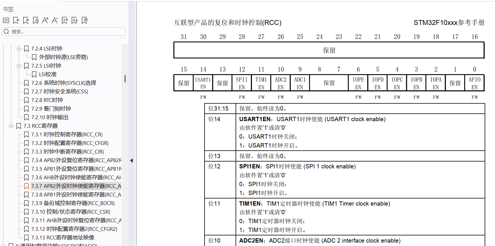

# 1. 配置环境

<D:\coding_codes\stm32\libs\STM32F10x_StdPeriph_Lib_V3.6.0\Libraries\CMSIS\CM3\DeviceSupport\ST\STM32F10x\startup\arm\> -> <p1:\start\> f103使用的是md选择产品型号

<D:\coding_codes\stm32\libs\STM32F10x_StdPeriph_Lib_V3.6.0\Libraries\CMSIS\CM3\DeviceSupport\ST\STM32F10x\.c.h> -> <p1:\start\>

<D:\coding_codes\stm32\libs\STM32F10x_StdPeriph_Lib_V3.6.0\Libraries\CMSIS\CM3\CoreSupport\> -> <p1:\start\>

<D:\coding_codes\stm32\libs\STM32F10x_StdPeriph_Lib_V3.6.0\Libraries\STM32F10x_StdPeriph_Driver\src\> -> <p1:\lib\>

<D:\coding_codes\stm32\libs\STM32F10x_StdPeriph_Lib_V3.6.0\Libraries\STM32F10x_StdPeriph_Driver\inc> 同上

<D:\coding_codes\stm32\libs\STM32F10x_StdPeriph_Lib_V3.6.0\Project\STM32F10x_StdPeriph_Template\config_it> -> p1\user

```c
runtime-mananger -> CMSIS -> core勾选自动下载coresupport支持文件
```


1. 修改<p1:\tartget1\group>为start并且添加.md和.c.h文件，添加start到include路径
2. 也可以直接创建group文件夹命名USER添加main.c文件

# 2. 烧录

1. 连接上之后应该是闪烁和常亮
2. debug->stlink:setting->flash->flash and run
3. 驱动ch340
4. stsw-link009驱动

# 3. 配置寄存器查询参考手册

1. 用RCC寄存器使能GPIO的外设，而GPIO的外设使用的是APB2外设时钟CRR_APB2ENER



- 位4写1其余写0，转化十六进制0x00000010

2. 配置端口高寄存器GPIOx_CRH，CNF13和MODE13配置13号，CNF通用推挽输出模式00，MODE最大输出50设置11，转化十六进制0x00300000
3. 端口输出数据寄存器ODR13写1

# 4. 配置库函数

1. 在stm32f10x.h文件尾有宏定义添加到c++ define
2. 函数名右键查找定义确定参数可能的值ctrl+F查找
3. 包含stm32f10x.h就包含了所有文件

