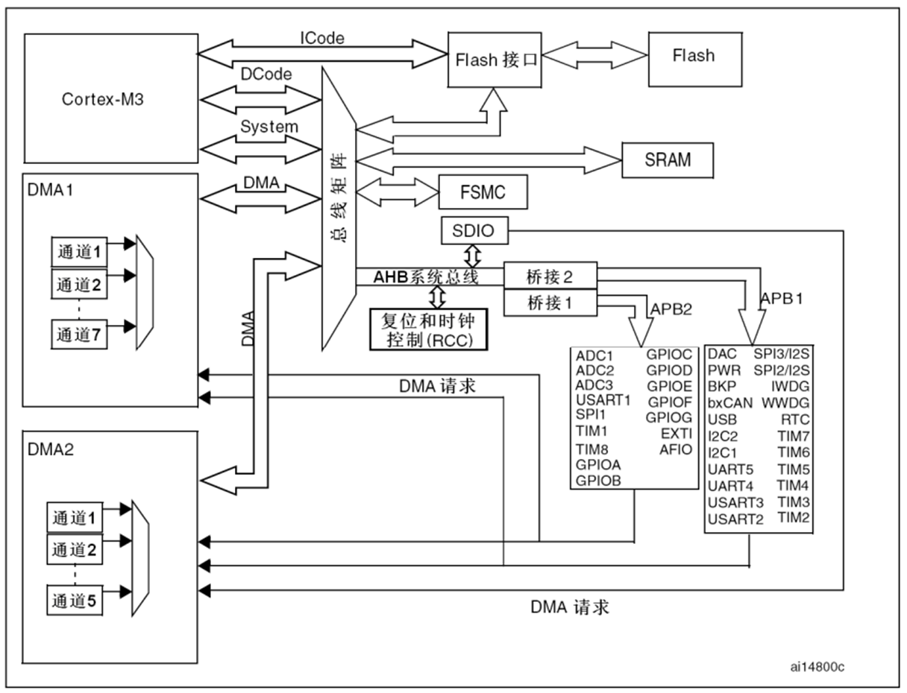
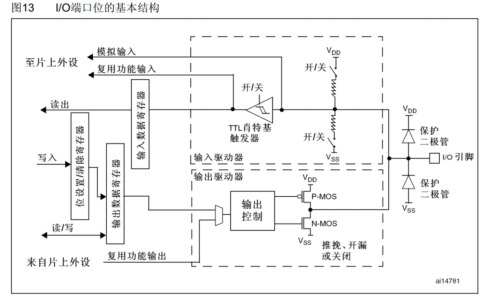
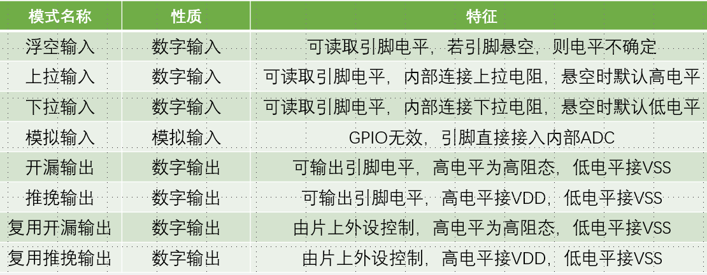

# 1. GPIO简介

1. 用途
   1. 输出：控制高低电平，驱动LED，控制蜂鸣器，模拟通信协议，控制外接模块（如果电压不够需要外接电源电压，3.3只是控制
   2. 输入：读取高低电平，读取按键输入，外接模块输入，ADC电压采集，模拟通行协议接受
2. 结构：都是在APB2总线上GPIO A~G 1~15，而每一组16个pin都有一个32位寄存器，只有低16位生效，寄存器存储数据，驱动器增大驱动能力
   1. 保护二极管：输入高于VDD或者低于VSS的时候连同，电流不进入内部
   2. 输入驱动器：可程序控制
      1. 上面导通，弱上拉：默认输入高电平
      2. 下面导通，弱下拉：
      3. 两都断开，浮空：易受影响
   3. 施密特触发器：只有高于上限或者低于下限的时候才会转变高低电平的读取，有效避免自然波形的干扰
   4. 模拟输入：连接ADC在施密特触发器前
   5. 复用端口输入：在施密特触发器后面，连接其他片上外设读取电平
   6. 输出数据寄存器同时控制16个端口，并且同时读写
   7. 位设置/位清除寄存器改变对应位实现
   8. 推挽输出（强推输出模式：PNMOS都生效，PMOS配合上拉，PMOS输入0连通，输出1，MCU有绝对控制权；推挽输出由CPU绝对控制，复用推挽输出可以由硬件，如tim2控制
   9. 开漏输出：NMOS生效，寄存器输出1时高阻模式，无驱动能力，作为通讯协议的输出模式，避免相互干扰；可在IO口外接5V电源，高阻时外部连通，VSS时内部接地
   10.  关闭：都不生效
   11. 输出控制：和寄存器取反的电平，从输出寄存器到端口两次翻转

3. 模式

4. 端口配置寄存器：每个端口需要4位进行配置，总共分为高低寄存器，而输入输出寄存器是只有低16位

# 2. 硬件电路

1. LED低电平强驱动，倾向于0时连通