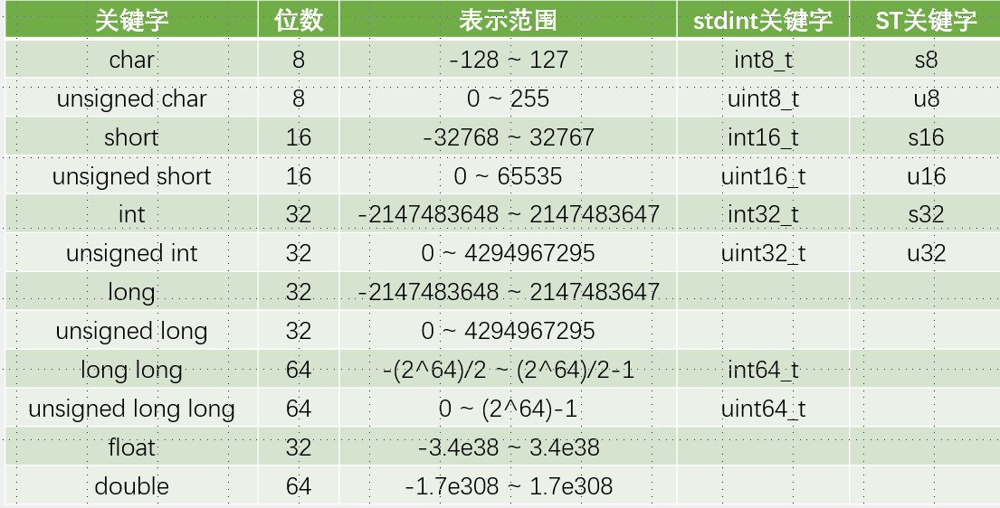

# 1. 按键

1. 按键抖动：机械式弹簧片判断
2. 消抖：添加延时
3. 常用下接按键，按下时接地，引脚上拉输入（可以是内部或者外部上拉

# 2. 传感器

1. 传感器电阻与定值电阻串联分压，便于检测电压
2. 滤波电容：保持电压稳定，一端接在电路，一端接地
3. 电压比较器LM393得到数字电压输出
4. 上下拉电阻：电阻越小，分压越小，拉力越大，输出电压是中间的输出

# 3. C语言

1. define是name value
2. typedef是value name;
3. enum枚举类型_t命名，规范值的类型，宏定义的集合