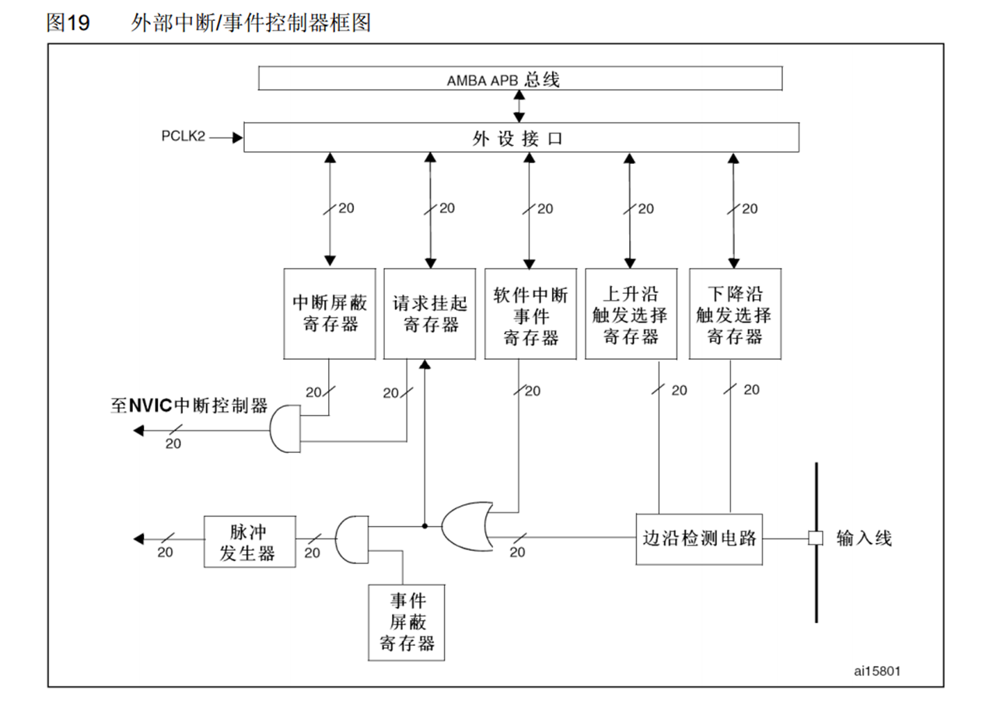
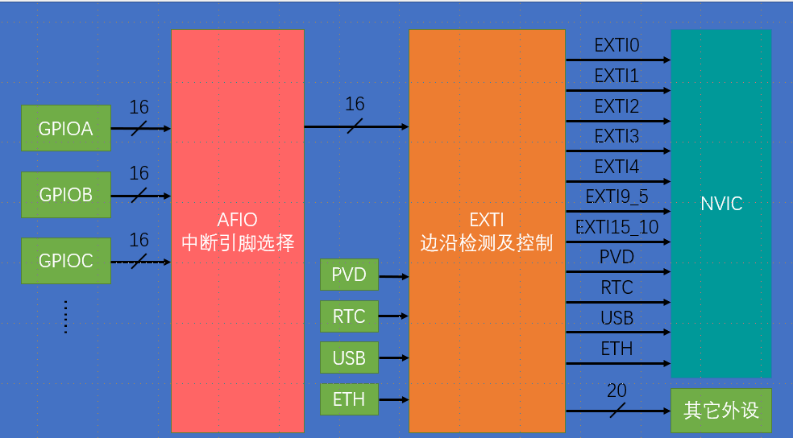
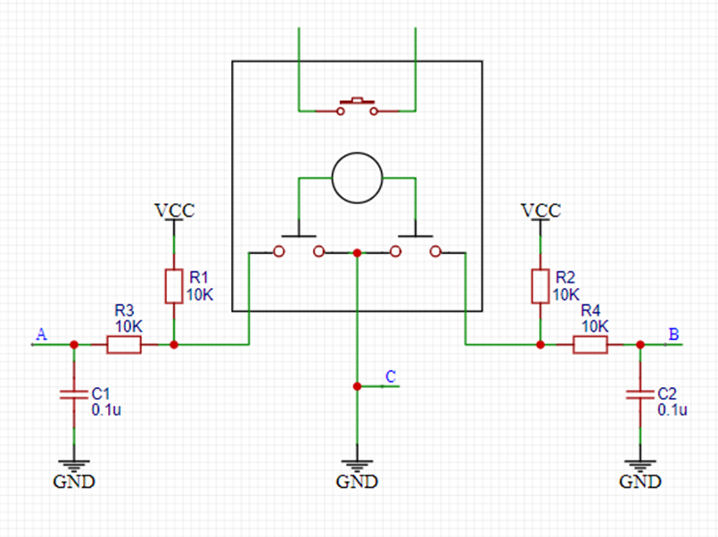

# 1.  中断系统

1. 在主程序的运行过程中出现了特定的中断触发条件（中断源），处理中断后返回断点，如串口接受数据，计数器+1
2. 中断优先级高的可以实现中断嵌套
3. 中断程序在子函数，当中断条件满足的时候自动调用
4. 使用NVIC统一管理中断，有16个可分配的优先级通道
5. 中断跳转时，先跳转到指定位置（中断向量表），再由编译器和新的地址，跳转到中断函数的位置
6. NVIC
   1. 内核外设，协助CPU
   2. 一个外设可能占用多个通道
   3. 优先级分组：优先级寄存器的4位决定，高n位的抢占优先级，低4-n位的响应优先级
      1. 抢占优先级高的可以中断嵌套
      2. 排队优先级高的可以先排队
      3. 两者相同的按照中断号排队
      4. 优先级的位数可以自主分配

# 2. EXTI外部中断

1. 监测指定GPIO电平变化时中断申请
2. 触发方式：上升，下降，双边，软件
3. 对象：所有GPIO口，但是ABC相同的pin不能同时触发
4. 通道数：16个pin，AFIO从ABC选一个（AFIO实现复用引脚重映射和中断选择
   1. PVD输出，电源从低电压恢复时，外部中断退出停止模式
   2. RTC时钟，stm32等闹钟响的时候再唤醒
   3. USB唤醒 
   4. 以太网唤醒
5. 响应方式：中断/事件 
6. 外部中断的9-5 15-10会分别触发同一个中断函数
7. 情景：外部突然有数据接受，如红外线，旋转编码器但是按键因为有抖动，不是突然产生，建议定时器中断

# 3. 旋转编码器

1. 用来测量位置，速度，旋转方向，旋转时输出与旋转方向速度相对应的方波信号，读取频率和相位信息得知
2. 类型：机械点触，霍尔传感器，光栅（遮挡与否）

