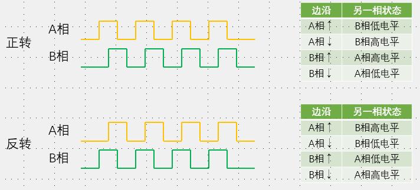

# 1. 编码器接口

1. 自动给编码器计次，优化了编码器旋转触发中断，在中断+1，浪费CPU资源
2. 接收增量（正交）编码器的信号，根据编码器旋转产生的正交信号脉冲，自动控制CNT自增或自减，从而指示编码器的位置、旋转方向和旋转速度
3. 每个高级定时器和通用定时器有一个编码器接口
4. 两个输入引脚借用了IC的12通道，TI1FP1和TI2FP2滤波器和边沿检测有使用IC
5. 正交编码器
   1. 一相作为时钟源，检测到边沿时，再根据另一相电平判断正反转
   2. 计数器的自增自减受编码器控制

