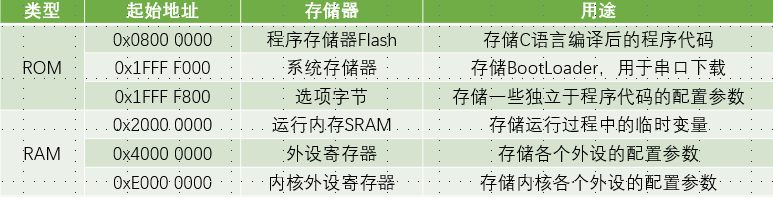
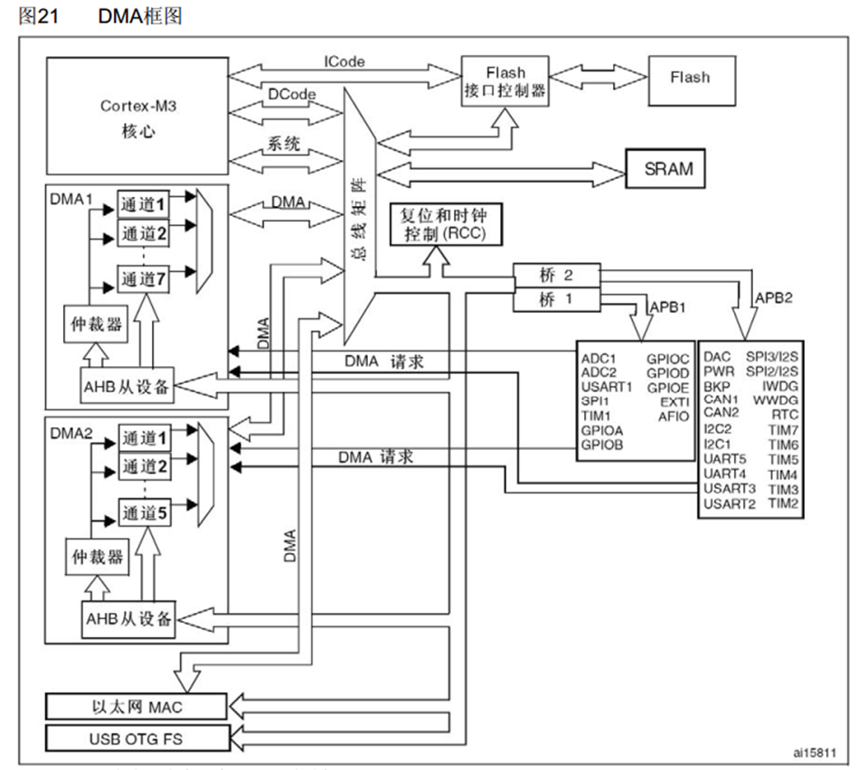
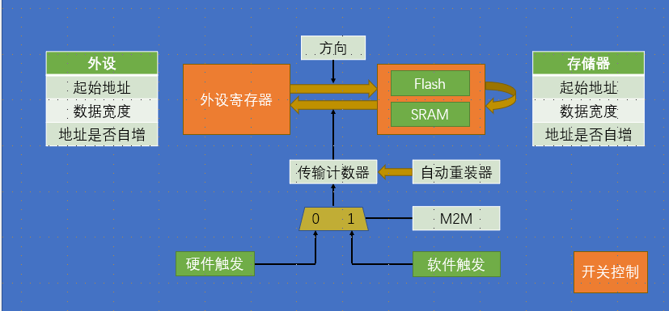
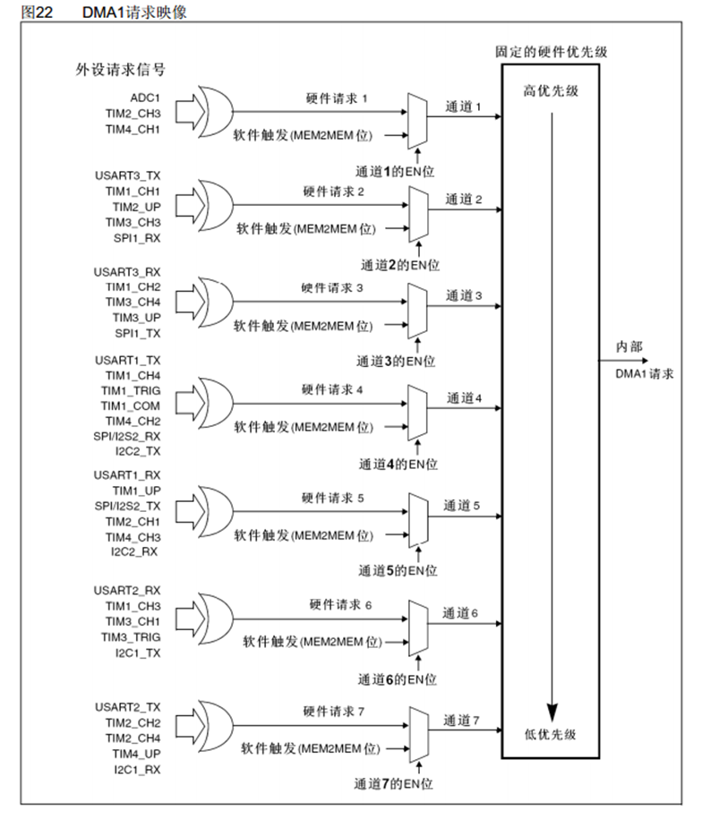
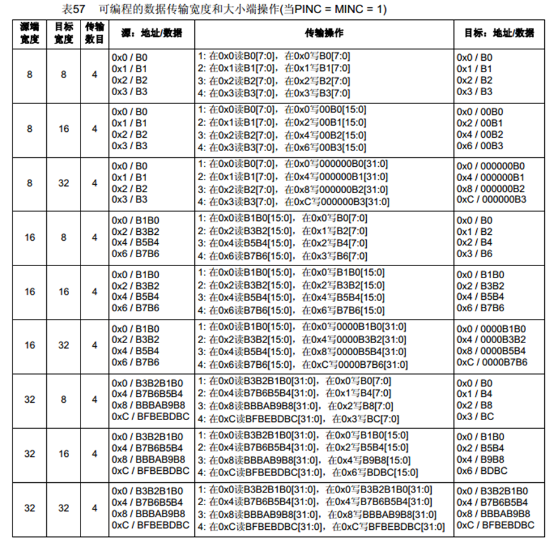

# 1. DMA简介

1. 直接存储器存取
2. DMA可以提供外设DR和存储器SRAM和FLASH（存储程序数组和代码）或者存储器和存储器之间的高速数据传输，无须CPU干预，节省了CPU的资源
3. 12个独立可配置的通道： DMA1（7个通道）， DMA2（5个通道）每个通道都支持软件触发和特定的硬件触发（存储器之间软件，外设因为需要等待一定的时机使用硬件触发），每个通道的触发源是指定的，如果需要使用指定的触发源，就需要对应的通道
4. STM32F103C8T6 DMA资源：DMA1（7个通道）
5. 存储器映像：32位读取有大量空余内存是没有使用
   1. ROM只读，掉电不丢失
      1. 主闪存flash程序运行开始的位置，以及常量
      2. 系统存储器和选项字节都是flsah介质
      3. bootloader厂家写入
      4. 选项字节：下载程序可以不刷新内容，存储读写保护和看门狗
   2. RAM随机存储，掉电丢失
      1. 内核外设如NVIC

6. DMA框图
   1. 寄存器是一种特殊的存储器，可以CPU直接读写，并且每一位背后都有一根独立的数据线控制硬件电路
   2. 外设就是寄存器，就是存储器
   3. 总线矩阵左边主动单元，可以主动读写右边被动单元的存储器
      1. DCODE专门访问FLASH
      2. 系统总线可以访问其他东西
      3. DMA各个通道可以设置转运的原地址和目的地址
      4. 仲裁器仲裁冲突
      5. AHB从设备，DMA有自己的存储器，能作为AHB总线上的被动单元被读写（CPU->DCODE->总线矩阵->配置
      6. DMA请求来自右边外设的硬件触发源
   4. flash只读

7. 基本结构图
   1. 方向：还可以是FLASH之间转换
   2. 数据宽度
      1. 字节8位，字32位（CPU是32位
   3. 传输计数器
      1. 指定需要传输几次
      2. 是自减寄存器
      3. 自减到0后会回复到起始地址（由自动重装器控制
   4. M2M
      1. 软件触发：以最快的速度触发DMA，使传输计数器0
      2. 软件触发不和自动重装器使用，死机循环
      3. 软件触发一般存储器之间的传输
      4. 软件触发的约束条件不仅有触发源，传输对象，还有自动重装器：m2m：（软件：不自动重装）是唯一确定的，外设可以合理搭配

8. DMA请求映像
   1. ADC_DMACMD，TIM_DMACMD控制是否触发

9. 数据对齐
   1. 存储地址是对存储单元进行编号
   2. 一个存储单元是8bit，对应两位十六进制数
   3. 宽度是bit单位
   4. 当传输多个byte时，地址编号下一位就不是临近+1，而是有一定的倍数跳转
   5. 目标宽度多了就高位补0，如8-16的0x00位就是00，0x01才是B0
   6. 源端宽度多了就高位舍弃
   7. 实际上就是一个右对齐的方式，指定目标宽度后此容器可能占多个字节，但是传入的数据按原字节顺序靠右排列，左边多退少补

