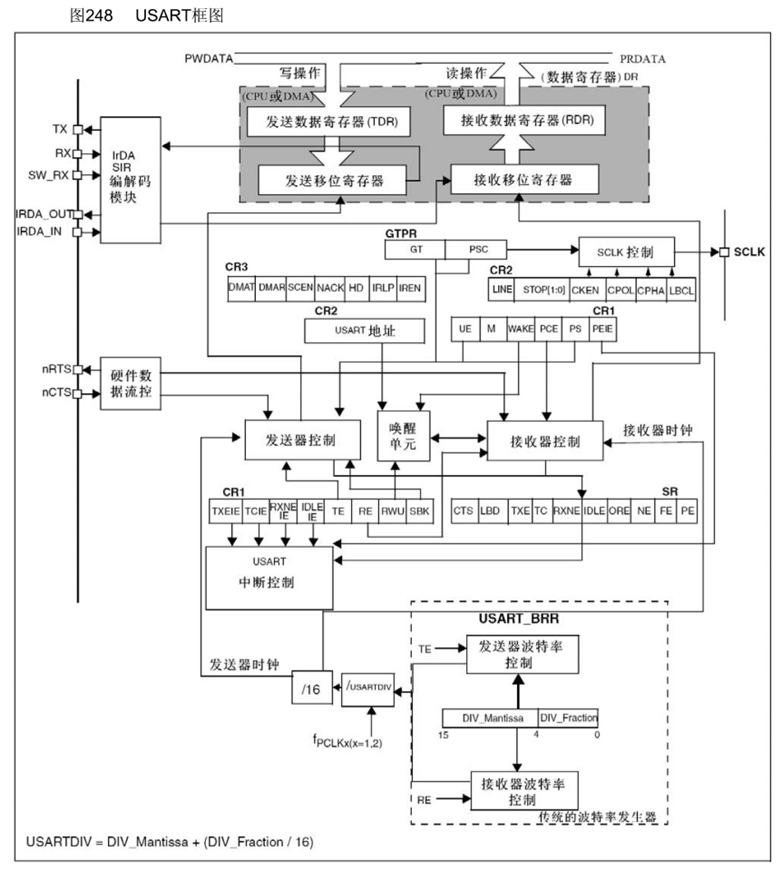
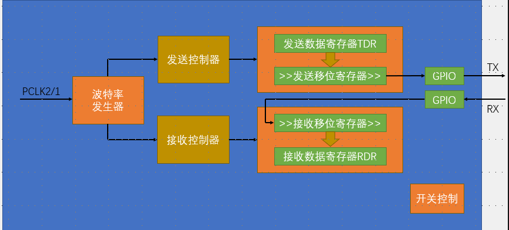
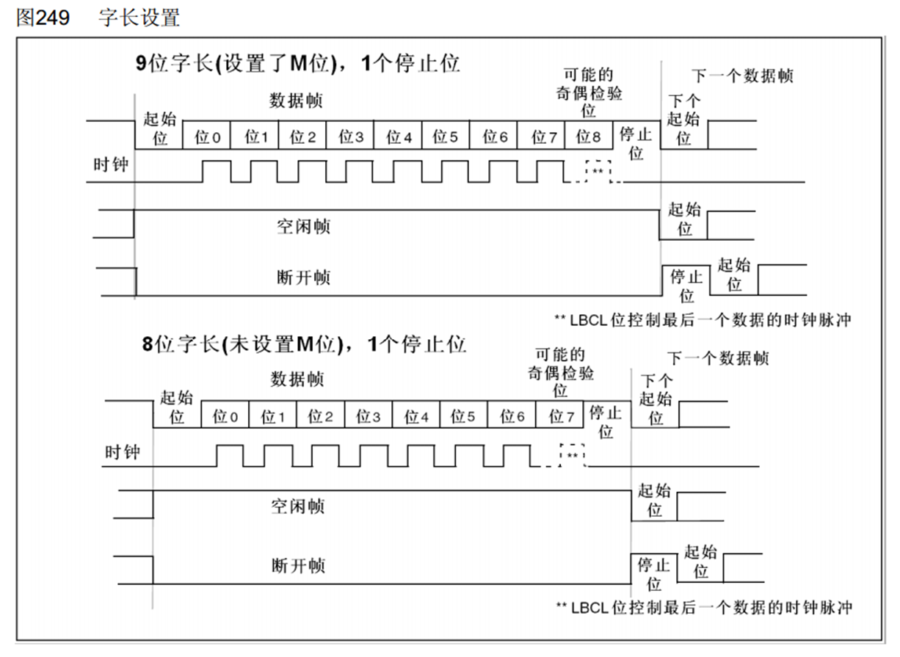
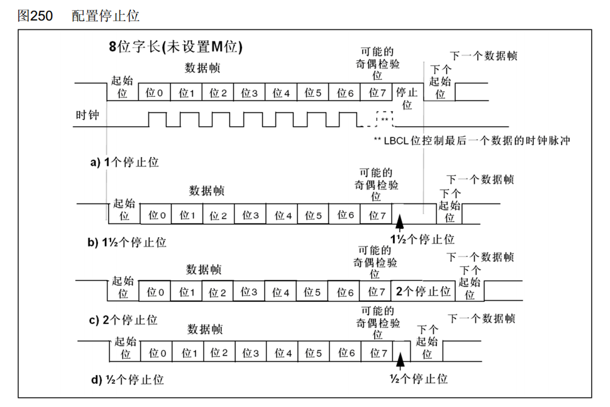
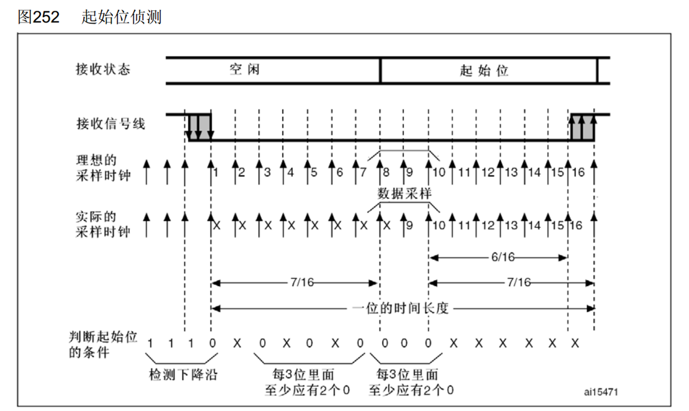

# 1. 串口外设

1. USART是STM32内部集成的硬件外设，可根据数据寄存器的一个字节数据自动生成数据帧时序，从TX引脚发送出去，也可自动接收RX引脚的数据帧时序，拼接为一个字节数据，存放在**数据寄存器**里
2. 自带波特率发生器（分频器），最高达4.5Mbits/s
3. 可配置数据位长度（8/9）、停止位长度（0.5/1/1.5/2）
4. 可选校验位（无校验/奇校验/偶校验）
5. 支持同步模式（加时钟）、硬件流控制（多一条数据线，接收端准备好置1）、DMA、智能卡、IrDA、LIN
6. STM32F103C8T6 USART资源： USART1(APB2)、 USART2、 USART3
7. 框图
   1. 发送数据：TDR只读。当TDR写入数据后，查看发送移位寄存器是否为空，空的就将TDR的值转移，并且置TXE为1，（未发送但是TDR是空的，可以缓冲数据），发送移位寄存器在发送控制器的驱动下向右移位并且发送到TX上（解释TX发送数据是低位先行）
   2. 接受数据：REXNE接受数据寄存器非空，可以读取数据；X低位先行，进入RX，进入接受移位寄存器且先进入的放在高位，并且来下一位之后同样也是右移，挪出高位接受数据（**不是整个接收完后再右移，而是在接受的过程中右移**）然后整个转移到RDR
   3. nRTS：请求发送，输出，告诉当前能否接受，n表示低电平有效
   4. nCTS：清除发送，输入，接受nRTS信号
   5. SCLK：配合发送移位寄存器产生同步信号。发送移位寄存器每移位一次，同步时钟电平跳变一个周期；仅支持输出。
      1. 使用别的协议如SPI
      2. 做自适应波特率：
   6. 唤醒单元：
      1. 实现串口挂载多设备：一条总线上接多个从设备，每个设备分配一个地址
   7. 中断输出控制：
      1. 选择中断能否通向nvic
   8. 波特率发生器
      1. 分频器时钟给发送和接受控制器
      2. 波特率 = fPCLK12 / (16 * DIV)

8. 数据帧
   1. 一个时钟跳动就是一位数据
   2. 一个时钟的上升下降不一定相等
   3. 对应关系：
      1. 数据帧=多个波特率时钟（常见181或者191，还有停止位非1情况
      2. 波特率时钟=一位数据（波特率发生器控制发送和接受控制器
      3. 一位数据时间长度=16采样周期
   4. 接收数据：
      1. 检测到一个数据帧（包括起始位，数据位，停止位）的起始位（数据帧是已经翻转之后发送到TX上的），就会以**波特率的频率（每秒的数据位数）**连续采样一帧数据，同时，从起始位开始，采样位置要对齐到位的正中间
      2. 异步通信只是规定了接受数据（每一位对应一次读取，所以也是读取频率）一样，但是本身两端的读取点的位置是不一样的（**相当于两个刻度尺相互独立，刻度一样，但是刻度线不一定对齐**）
      3. 接收端在一个**数据帧**（不止一个波特率时钟）后需要以波特率的频率（一位数据）进行读取，并且每次都在波特率时钟的中心。
      4. 为实现3，在检测到下降沿后，进行一个波特率频率16倍的采样（检查这一位是否是起始位），满足357,8910里面各至少有两个0，则为起始位，并且开始读取，且 8910就是读取位的中心；如果有噪声，置NE1
      5. 在起始位之后，有噪声按2:1比例，并且置NE1
   5. 在有校验位的9位中，校验位不会作为数据传输，所以接发数据仍然是8bit合适

