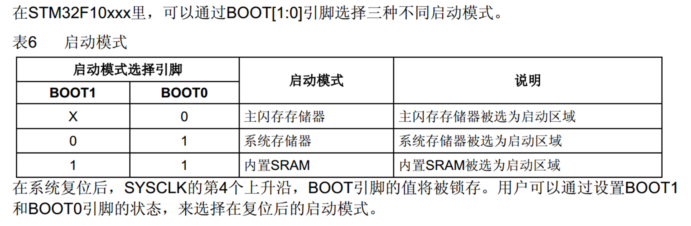

# 1. 使用串口下载程序

1. 生成hex文件；mcufly下载
2. bootloader
   1. 存储于系统存储区
   2. 是一个独立的程序
   3. 接受USART1的数据并且刷新flash（flash本身就是下载的程序存储位置）
   4. 更新完毕启动

3. 选项字节
   1. 同样独立于flash程序
   2. 可以通过上位机直接修改选项字节，用于用户自定义
   3. 写保护：解除写保护会直接清除