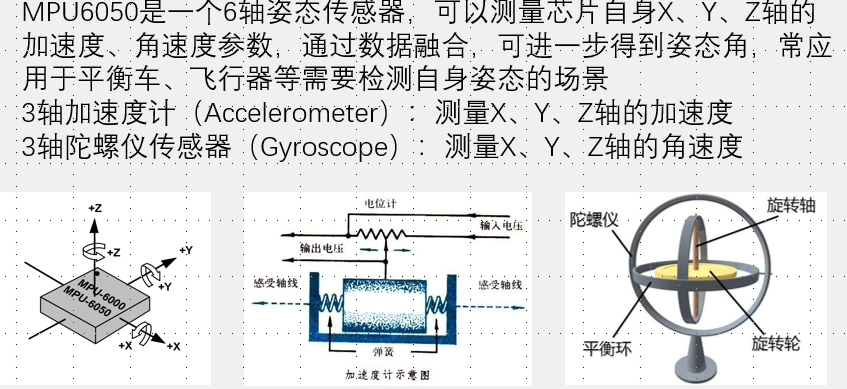
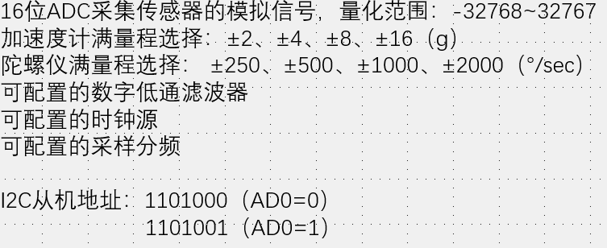
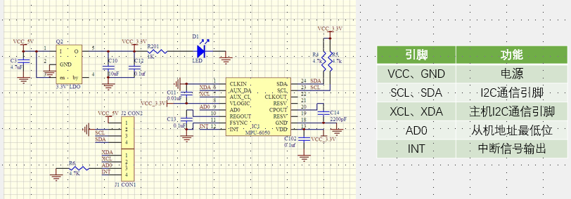
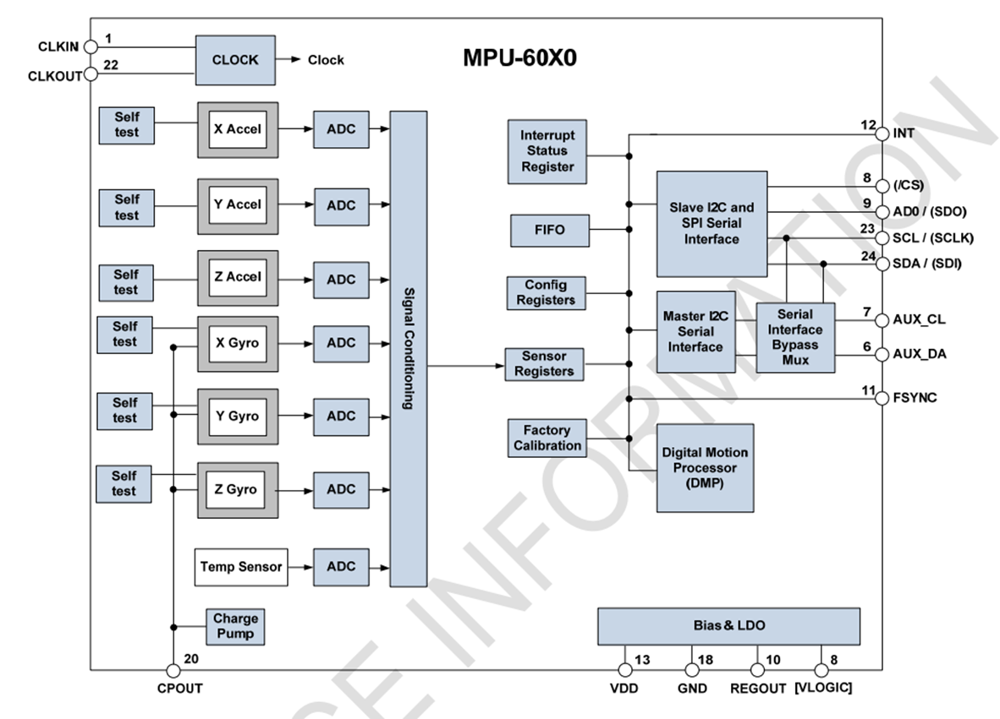
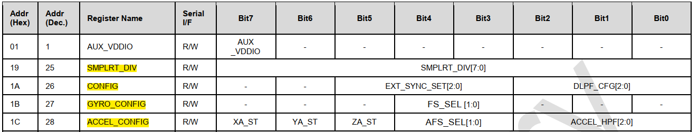
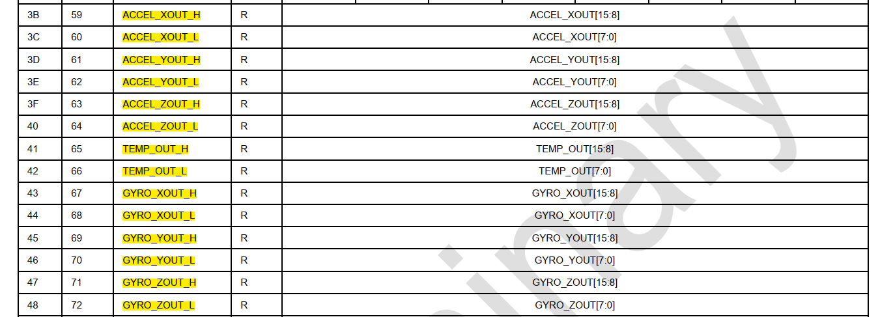
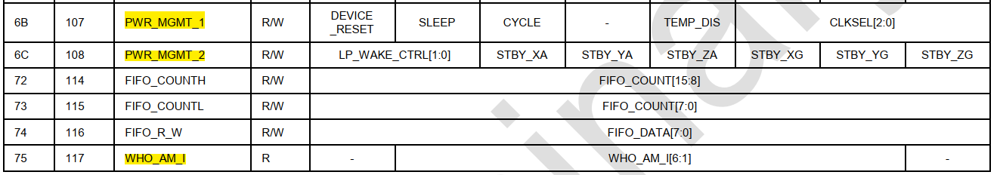

# 1. MPU6050

1. 简介
   1. 9轴：磁场反应南北方向
   2. 10轴：气压反应高度
   3. 加速度计和弹簧测力计基本一致；具有静态稳定性，动态受运动状态的影响
   4. 陀螺仪：静止时，有噪声的干扰，积分后角度会偏移，具有动态稳定性
   5. 结合两者的稳定性互补，实现互补滤波
   6. 配置时钟调节ADC转换快慢

2. 硬件电路
   1. SCL和SDA已经内置上拉电阻，只需直接接在GPIO并且设置开漏输出
   2. XCL和XDA扩展作为主机外接磁力计和气压计，实现9-10轴

3. 框图
   1. 时钟部分不用关心（时钟来自内部晶振，陀螺仪晶振，外部时钟引脚方波）
   2. 只需设置数据频率，读取到的数据按照频率传输到寄存器
   3. 自测响应：自测使能失能的数据差，在一定范围内则满足
   4. CPOUT电荷泵作为升压电路（boost电路，并联充电，串联放电），支持内部陀螺仪
   5. 寄存器和通讯接口
      1. 中断状态寄存器：控制内部哪些时间到中断引脚的输出
      2. FIFO：先进先出寄存器，对数据流进行缓存
      3. 配置寄存器
      4. 传感器寄存器（数据寄存器）
      5. 工厂校准
      6. DMP数字运动处理器，姿态解算硬件算法，配合DMP库
      7. 接口旁路选择器：扩展的设备共用一个I2C，保留STM32作为主设备

4. 寄存器
   1. 采样频率分频器，调节分频系数（要-1），系数越小采样越快，ADC转化越快
      1. 不使用低通滤波时，陀螺仪时钟（内部时钟）8kHz，使用时1kHz
   2. 配置寄存器
      1. 外部同步设置（不用
      2. 低通滤波器设置（参数越大，抖动越小
   3. 陀螺仪配置寄存器
      1. 前三位是自测使能位
      2. 量程选择位：量程越大，范围越小，分辨率低
   4. 加速度计配置寄存器：同上
      1. 后三位：配置高通滤波器
   5. 数据寄存器
      1. 加速度计：16位有符号数，以二进制补码存储；高位左移8位，或上低位，存储在int16类型转换
   6. 电源管理寄存器1
      1. 设备复位，写1复位
      2. 睡眠模式，低功耗（上电默认睡眠模式
      3. 循环模式，低功耗，并且隔一段时间启动一次，唤醒频率受2控制
      4. 温度传感器失能
      5. 后三位选择系统时钟来源（内部部晶振，陀螺仪晶振，外部方波）推荐陀螺仪晶振
   7. 电源管理寄存器2
      1. 前两位控制循环模式频率
      2. 分别控制六个轴的待机模式
   8. 器件ID号
      1. 只读
      2. AD0引脚可以配置最低地址，但是寄存器里的ID号保持是0X68

