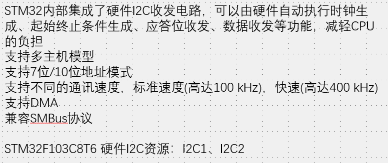
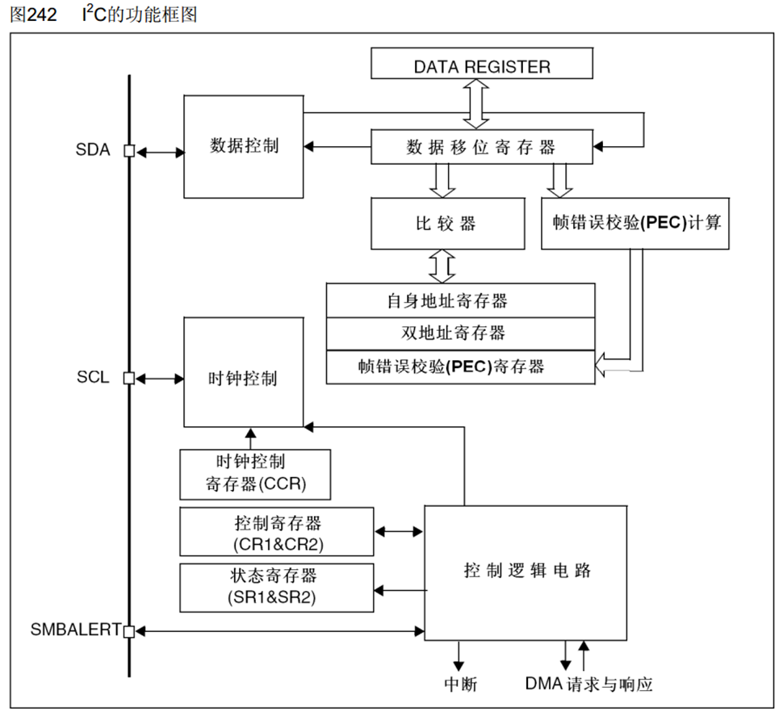
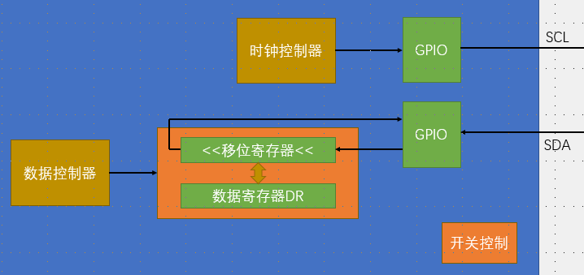
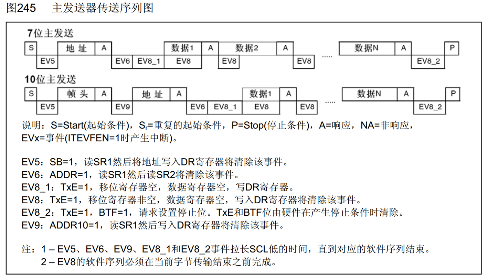
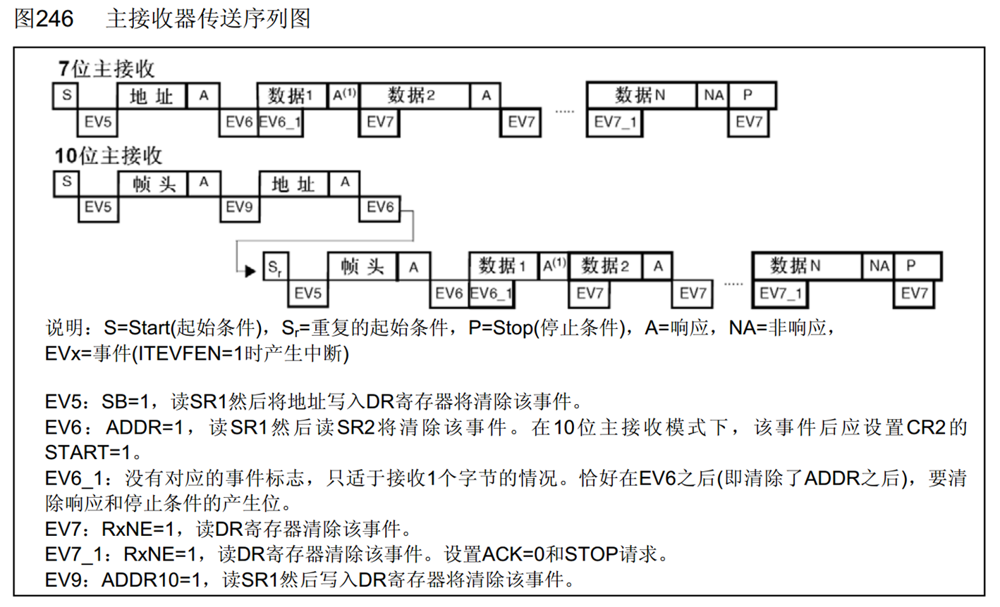
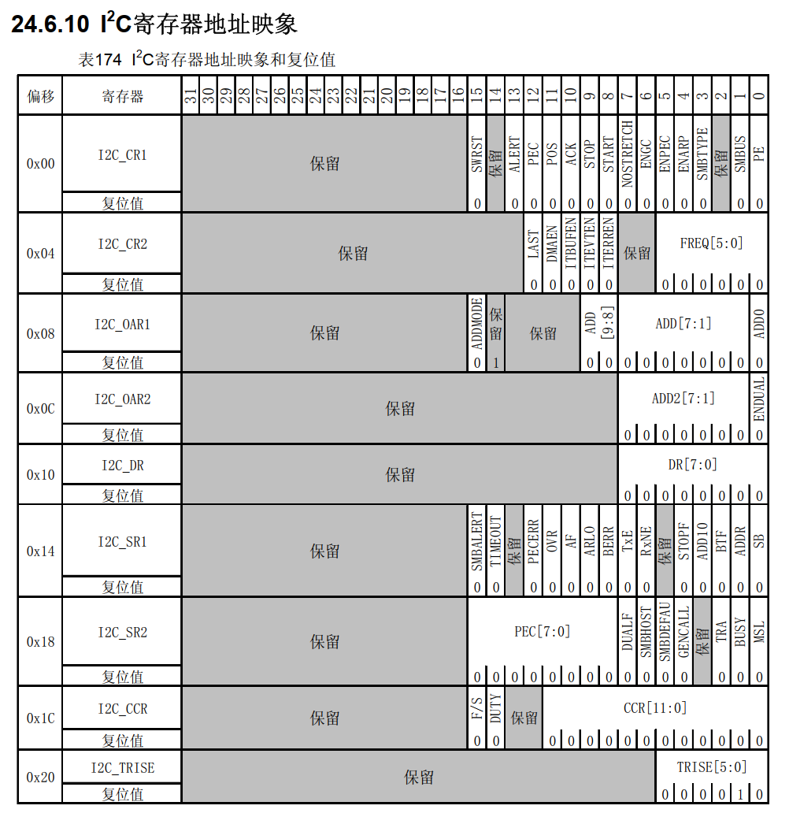

# 1. I2C 外设

1. 多主机模式
   1. 固定多主机：主机是固定的几个，冲突仲裁
   2. 可变多主机：stm32是可变多主机模式，

2. 框图
   1. 发送：依旧数据寄存器的值转进数据移位寄存器，置状态寄存器TXE为1，发送寄存器为空
   2. 接受：移位寄存器进数据寄存器，置RXNE1，接受寄存器非空
   3. 比较器和地址寄存器：作为从设备使用

3. 结构图
   1. 高位先行：左移位
   2. GPIO配置复用开漏

4. 主机发送
   1. STM32默认是从模式，要获得控制器，控制寄存器START写1，
   2. EV事件可能产生多个标志位（标志位不是进行判断，而是**运行的结果同时是判断的条件**
   3. EV8_2当移位寄存器和数据寄存器都是空状态表示数据结束，可以产生终止条件
   4. 产生起始条件的函数实际上是在控制寄存器CR的START1，自动产生起始条件；由于产生起始条件，说明STM32变成主模式（默认是从模式）；当起始条件发送完之后，会置标志位，检查标志位进而检查起始条件是否发送完成
   5. 在起始条件发送之后，会置状态寄存器SR1的SB1，表示已经发送起始条件；而SB在读取SR1并且再读取数据寄存器的时候会自动清除，所以不需要手动清除
   6. **EV5起始条件已经发送**
   7. **VE6地址已经发送**（设定第一个必须是地址，虽然第二个也可以是地址）
   8. **EV8_1，移位寄存器和DR都空**（此时允许写入数据）(但是**不作为判断条件**，因为上次结束后一定是空的)
   9. **EV8，移位寄存器非空，DR空**（**转入同时开始发送数据，所以此时表示正在传输，并且可以写入下一个数据**）（当DR写入将清除，所以在连续传输数据过程中，移位寄存器空了就会自动部DR，保持非空，只有结束的时候才会再出现EV8_1，实际上是结合停止位的EV8_2；DR在连续发送的时候在空和非空之间切换，并且写入就会清除标志位）
   10. **EV8_2，传输完了，移位寄存器和DR都空，才作为终止条件的判断条件**（区别于8_1，想要再找DR且DR空产生8_2
   11. 从软件的完整时序：5,6,8_2都是上一步的完成的结果作为下一步的时序条件，但是8是上一步正在进行的过程允许下一步也开始（senddata只是对DR写入，只要DR空就可以写入，并且会在移位寄存器空的时候自动移入，移位寄存器会自动移位输出，所以是一条**完整的自动链**。**<u>或者说，产生起始条件，传输地址的函数都是“望文生义”（实际上，完成标志位的EV和完整时序的EV重合），但是senddata只是对DR寄存器操作，下一次判断能否senddata的EV还没有完整的发送数据，只是正在发送，但是运行对DR操作</u>**。

5. 主机接受
   1. EV6_1只是移位寄存器状态非空，表示正在一个数据，数据在接受到后会自动传到DR，并且发送响应（响应应该是先发送的，因为转移还要时间）
   2. **EV7表示DR有数据可以读取，同理EV8**，DR无数据可以写入，函数也只是对DR寄存器进行操作；**本数据的EV7作为下一个数据已经进入移位寄存器时reveive本数据的条件**对于最后一个数据的EV7在停止条件前后
   3. EN7_1在receive最后一个字节之前（多的一个数据进入移位寄存器之前），提前置ACK0和STOP1位，如果只读一个，要在EV6之后立刻置，其余在倒数第二个数据的receive之后置ACK1（最后一个之前

