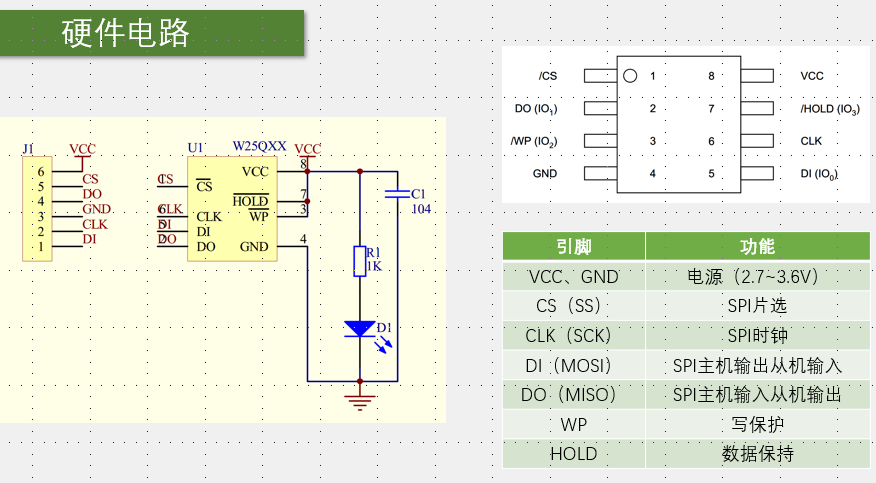
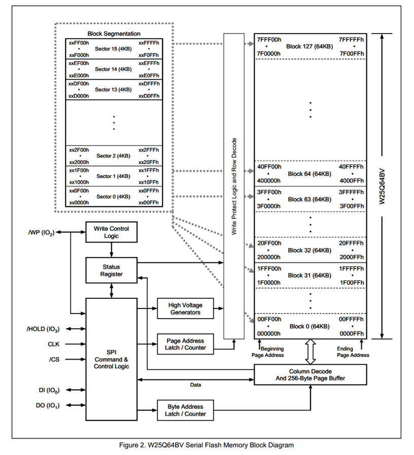
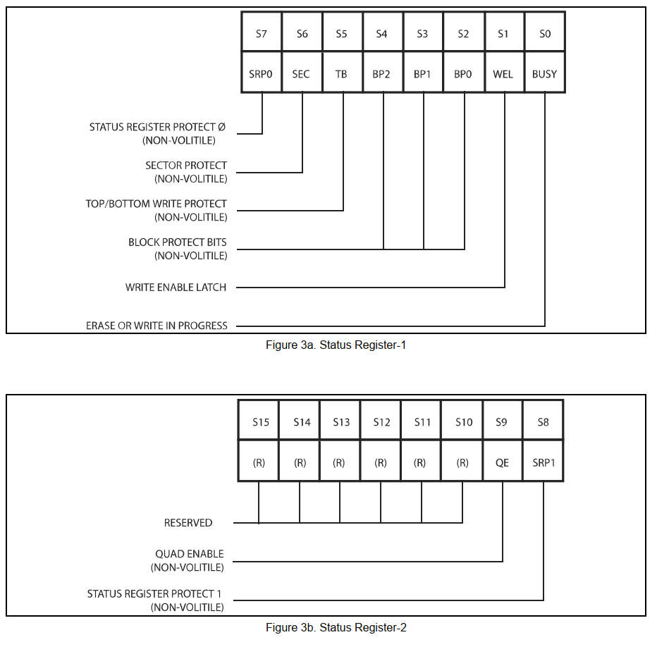
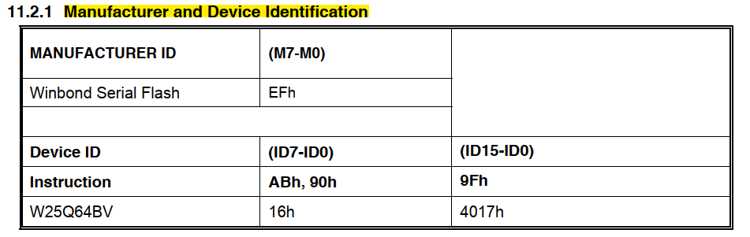
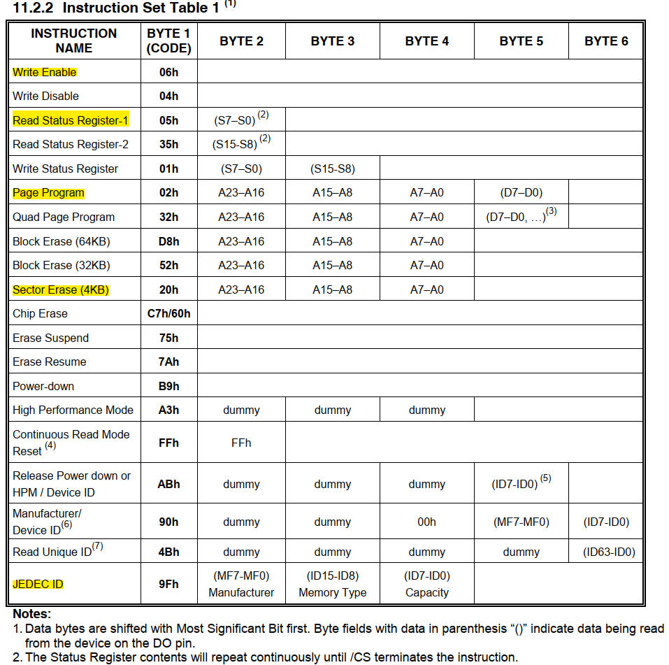

# 1. W25Q64简介

1. 使用的是24位地址（三字节地址模式
2. 电路结构
   1. /CS表示低电平有效

3. 框图
   1. 为了配合内存管理，划分为BLOCK（64KB再划分为SACTOR4KB，PAGE256B
   2. 高电压发生器：FLASH掉电不丢失
   3. 对指定位地址解码获得选择信号
   4. 芯片写入先缓存到寄存器，然后置状态寄存器BUZY，随后高压发生器写入芯片

4. 注意事项

   1. 写入操作时：

      1. 写入操作前，必须先进行写使能（是一个指令
      2. 每个数据位只能由1改写为0，不能由0改写为1
      3. 写入数据前必须先擦除，擦除后，所有数据位变为1（高频改动的SACTOR可以单独存储在RAM
      4. 擦除必须按最小擦除单元进行（SACROR4KB
      5. 连续写入多字节时，最多写入一页的数据，超过页尾位置的数据，会回到页首覆盖写入
      6. 写入操作（包括擦除）结束后，芯片进入忙状态，不响应新的读写操作（搬运中）
   2. 读取操作时：直接调用读取时序，无需使能，无需额外操作，没有页的限制，读取操作结束后不会进入忙状态，但不能在忙状态时读取

