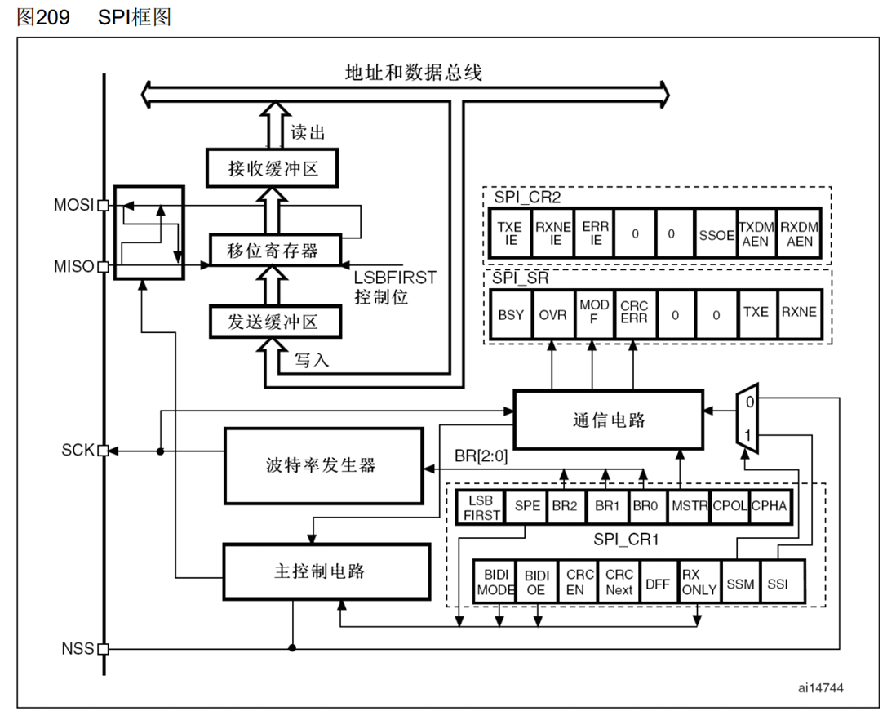
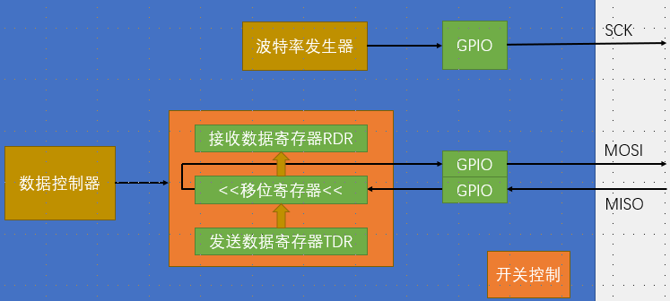
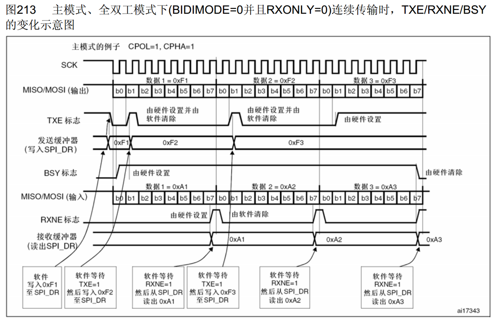
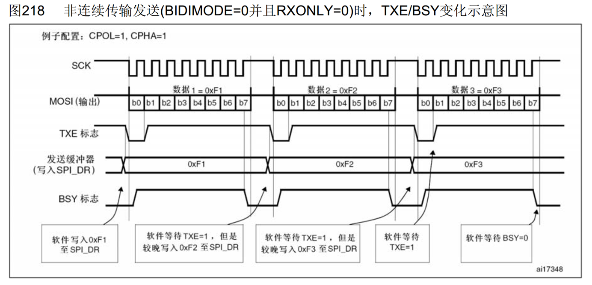

# 1. SPI外设

1. 可配置8位/16位数据帧、高位先行/低位先行
2. 时钟频率（波特率）： fPCLK / (2, 4, 8, 16, 32, 64, 128, 256)（由外设时钟分频得到）（SPI1挂在APB2，72M，SPI2在APB1，36M
3. 支持DMA
4. 兼容I2S
5. 框图
   1. LSBFIRST1右移
   2. SPE SPI_Cmd()
   3. BR设置波特率
   4. MSTR配置主从模式
   5. NSS作为从机的SS

6. 基本结构

7. 时序

