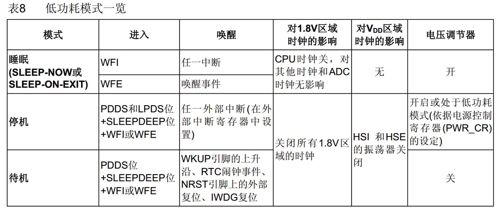
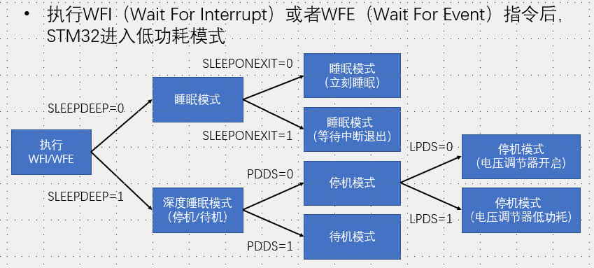
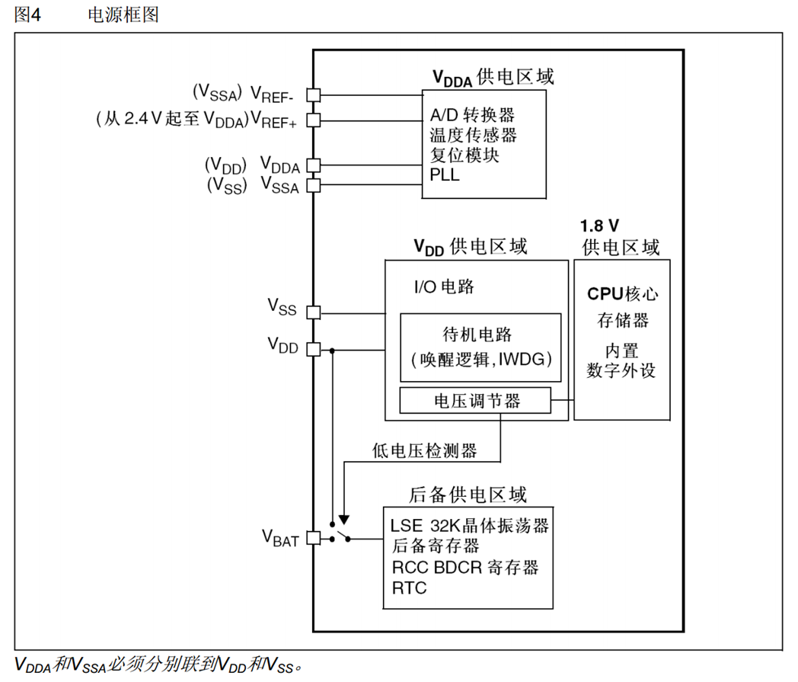
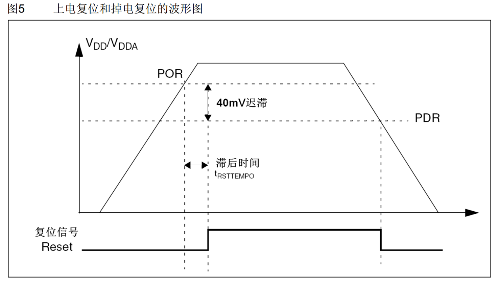
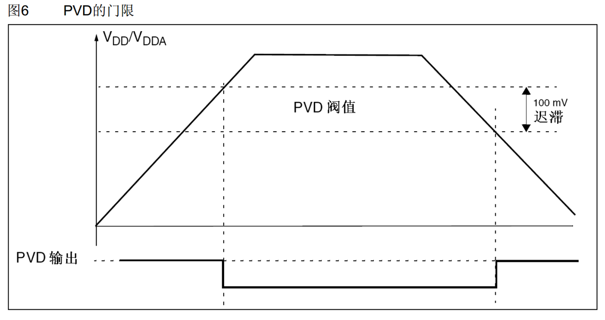

# 1. PWR电源控制

1. 负责STM内部供电，可以实现可编程电压检测器和低功耗模式
   1. PVD可以监控VDD，当下降或者上升阈值可以触发中断
   2. 低功耗：但是保留唤醒接口，外部中断唤醒
      1. 睡眠：
         1. WAIT FOR INTERRUPT，唤醒先处理中断函数
         2. WFE可以是**外部中断配置为事件模式**，也可以是**使能中断但是没有配置NVIC**（有中断就有标志位，就会有事件），一般不需要处理中断函数
         3. **只关闭CPU时钟**，SRAM和寄存器保留数据
         4. RCC_APB2PhericCmd()只是打开总线和外设寄存器，允许时钟驱动外设寄存器接受总线修改数据。在休眠模式下，**寄存器内部功能时钟无影响**，继续工作。**上电会自动触发复**位。**GPIO状态保持**
      2. 停止
         1. PDDS0，SLEEPDEEP1
         2. LPDS0配置电压调节器开启，1进入低功耗（电压调节器开启与否都是可以保持数据，只是省电与否）
         3. 必须是外部中断或者事件WFE；
         4. **CPU和外设的时钟都暂停**，SRAM和寄存器保留数据，**GPIO状态保持**
         5. **当被唤醒时，使用HSI8M**（默认是HSE），并且电压调节器低功耗时，从停止模式退出，会有额外的启动延时
      3. 待机
         1. PDDS1，SLEEPDEEP1
         2. 只有指定事件可以唤醒：**WKUP上升沿，RTC闹钟事件上升沿，NRST引脚上升沿（外部复位），IWDG复位**
         3. 配合RTC和IWDG的LSE和LSI保持正常工作
         4. SRAM和寄存器丢失，**只有后备区正常**
         5. 程序唤醒后从头开始执行
      4. 从上到下越省电

1. 框图
   1. 电压调节器给1.8V供电

3. 上电或掉电复位
   1. 电压迟滞防止在阈值附近反复

4. 可编程电压检测器
   1. 低电平1
   2. 可以配置外部中断实现唤醒低功耗模式

